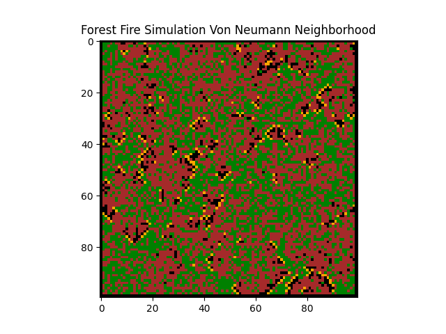
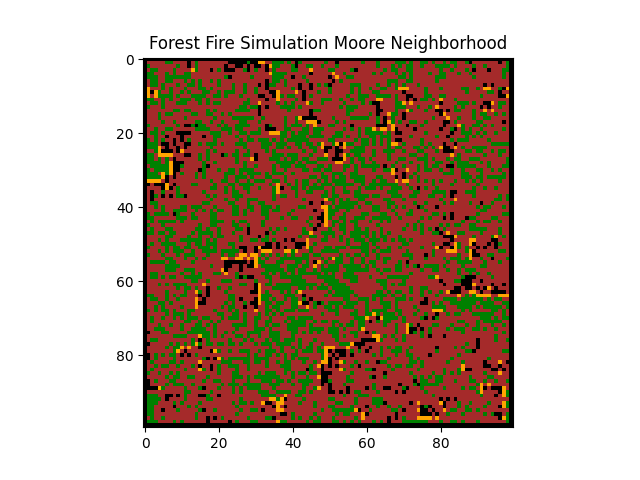

# Cellular automata - forest fire algorithm

## Popis problému

Forest fire model je speciální případ algoritmu Cellular Automaton znázorněný ve 2D prostoru, který se řídí následujícími pravidly:

1. Prázdná oblast nebo shořelý strom je s pravděpodobností p nahrazen živým stromem nebo zůstane prázdný
2. Strom začne hořet, pokud jeho soused hoří
3. Pokud žádný sousední strom nehoří, strom začne hořet s pravděpodobností f
4. Pokud strom hoří, nakonec vyhoří a zůstane spálený

Pro simulaci jsem použila následující hodnoty:
- p = 0.05 (pravděpodobnost vzniku nového stromu)
- f = 0.001 (pravděpodobnost spontánního vznícení)
- hustota lesa = 0.5 (počáteční hustota stromů)

Pro definici sousedství jsem implementovala dva přístupy:
- von Neumannovo sousedství (4 sousedé - nahoře, dole, vlevo, vpravo)
- Moorovo sousedství (8 sousedů - všechny okolní buňky)

## Implementace

Pro implementaci jsem vytvořila třídu ForestFireSimulation, která zahrnuje:

- Inicializaci lesa s náhodným rozmístěním stromů podle zadané hustoty
- Definici stavů: EMPTY (prázdný), TREE (strom), FIRE (oheň), BURNT (spálený)
- Aktualizační funkci, která v každém kroku aplikuje pravidla na všechny buňky
- Vizualizaci pomocí knihovny matplotlib s barevným odlišením jednotlivých stavů
- Možnost spuštění nekonečné animace

Implementace používá NumPy pro efektivní práci s maticemi a matplotlib pro vizualizaci. Ohraničení matice je nastaveno jako spálené stromy, aby se zamezilo indexování mimo rozsah.

## Výsledek

Simulace ukazuje dynamické chování lesního požáru s oběma typy sousedství. Je zajímavé pozorovat, jak se vzory šíření ohně liší:

- Von Neumannovo sousedství (4 sousedé) vede k pravidelnějšímu šíření ohně, který se pohybuje ve čtyřech hlavních směrech
- Moorovo sousedství (8 sousedů) umožňuje ohni šířit se také diagonálně, což vede k rychlejšímu šíření a komplexnějším vzorům

Simulace běží nekonečně dlouho díky regeneraci stromů, takže můžeme pozorovat, jak se dynamicky mění stavy lesa - od hustého zalesnění, přes požáry až po regeneraci.

