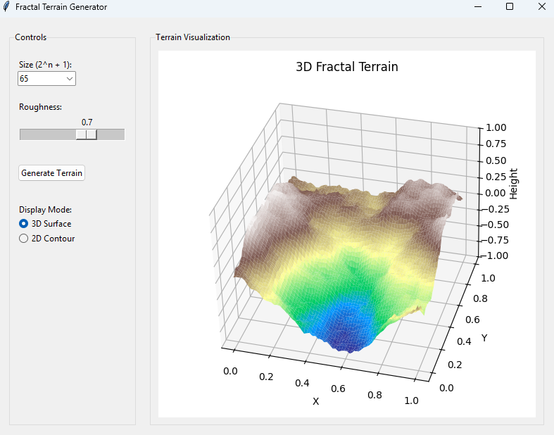
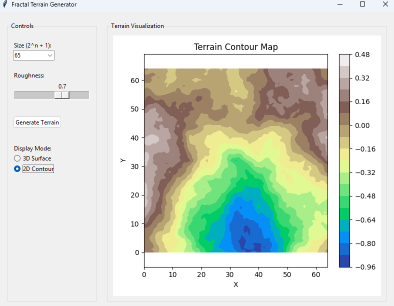

# Fractal landscape

## Popis
Implementace generátoru fraktálního terénu pomocí algoritmu Diamond-Square. Aplikace umožňuje uživateli nastavit parametry generování terénu a zobrazit výsledek v 2D nebo 3D režimu.

## Implementace

### TerrainGenerator
Třída TerrainGenerator je jádrem celého systému a implementuje algoritmus Diamond-Square:
- Generuje výškovou mapu zadané velikosti (2^n + 1)
- Používá parametr drsnosti (roughness) k řízení variability terénu
- Algoritmus se skládá z opakovaného dělení a náhodného posouvání bodů
- Implementace obsahuje dva klíčové kroky:
  - výpočet středu čtverce z jeho rohů
  - výpočet středů hran z okolních bodů

### TerrainApp
Třída TerrainApp poskytuje grafické rozhraní pomocí knihovny Tkinter:
- Ovládací panel s nastavitelnými parametry pro generování terénu
- Rozbalovací menu pro výběr velikosti (2^n + 1)
- Posuvník pro nastavení drsnosti terénu v rozmezí 0.1 až 1.0
- Přepínače pro zobrazení ve 2D nebo 3D režimu
- Tlačítko pro generování nového terénu
- Vizualizační panel využívající knihovnu matplotlib
## Hlavní prvky
- Nastavitelné iterace (2^n + 1)
- Nastavitelná drsnost (roughness) terénu
- Přepínání mezi 2D a 3D zobrazením
- Možnost generování nového terénu

## Algoritmus
Program používá rozšířenou implementaci algoritmu Diamond-Square:
1. Nastaví hodnoty ve čtyřech rozích čtverce
2. Pro každý čtverec vypočítá hodnotu středového bodu jako průměr čtyř rohů plus náhodná odchylka
3. Pro každý diamant vypočítá hodnoty středů hran jako průměr dostupných okolních bodů plus náhodná odchylka
4. Rozdělí čtverce na menší a opakuje kroky 2-3 s klesající odchylkou
5. Pokračuje, dokud nejsou vyplněny všechny body ve výškové mapě

## Vizualizace
- **3D režim**: Zobrazuje terén jako trojrozměrný povrch s barevným gradientem podle výšky
- **2D režim**: Zobrazuje terén jako vrstevnicovou mapu, kde barvy reprezentují různé výškové úrovně

Výsledkem je realisticky vypadající terén s různými výškovými úrovněmi zobrazený pomocí barevné škály odpovídající nadmořské výšce.

