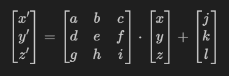

# IFS

## Popis problému
Cílem tohoto úkolu bylo implementovat dva fraktálové modely na základě IFS (Iterated Function System), konkrétně fern-like (kapradinové) 3D fraktály. Každý model je definován pomocí čtyř afinních transformací, které se náhodně vybírají s pravděpodobností 0.25. Výsledkem je vizualizace trojrozměrných fraktálů generovaných iterativním aplikováním těchto transformací.

## Struktura sítě
IFS model se skládá ze čtyř transformačních funkcí, z nichž každá je definována 3×3 transformační maticí (pro transformaci vektoru v 3D prostoru) a translačním vektorem. Pro každý nový bod se náhodně vybere jedna z těchto transformací, která se následně aplikuje na aktuální bod.

Transformace mají obecný tvar:

<div align="center">
  
</div>


## Implementace
Celé řešení je rozděleno do několika částí:

- `IFSModel` – reprezentuje samotný IFS model. Obsahuje metodu `apply`, která náhodně vybírá jednu transformaci a aplikuje ji na daný bod.
- `IFSMain` – zajišťuje generování fraktálu pomocí iterativního volání modelu a ukládání výsledků do historie.
- `IFSUI` – stará se o 3D vizualizaci pomocí knihovny `plotly`.
- `models.py` – definuje dvě sady transformací pro dva různé fraktálové modely.
- Hlavní skript provádí zobrazení obou modelů pomocí 10 000 a 1 000 iterací.

Ukázka hlavní části generování:

```python
def generate(self):
    point = np.zeros(3)
    for _ in range(self.iterations):
        point = self.model.apply(point)
        self.history.append(point)
```

## Výsledek
Výstupem jsou dvě vizualizace ve 3D prostoru, které reprezentují fraktální kapradiny vytvořené na základě IFS transformací. První model připomíná klasický tvar kapradiny s výrůstky, druhý model je prostorově bohatší a má komplexnější strukturu, připomínající rozvětvenou rostlinu.

Fraktály se generují pokaždé jinak díky náhodnému výběru transformací, přičemž výsledný tvar je vždy podobný, ale ne zcela identický, což ukazuje sílu iterativních stochastických metod v počítačové grafice.