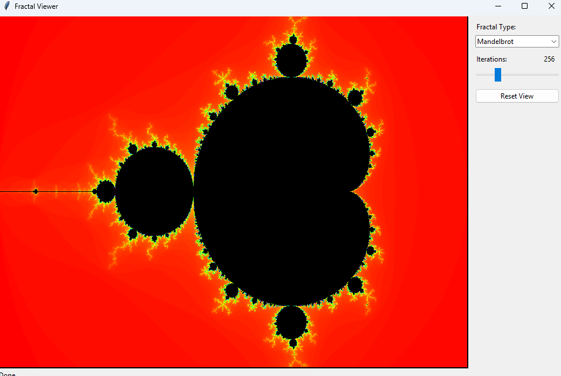
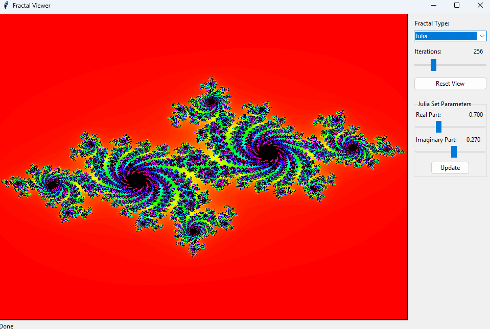

# TEA - Mandelbrot set or Julia's set

## Popis problému
Úkolem bylo vytvořit aplikaci pro zobrazování a interakci s fraktály, konkrétně s Mandelbrotovou a Juliovou množinou. Tyto matematické objekty vznikají opakovaným použitím jednoduché funkce z komplexních čísel. Cílem bylo implementovat nejen zobrazení těchto fraktálů, ale také umožnit uživateli prozkoumávat jejich strukturu pomocí přiblížení a změny parametrů.

## Implementace
Úkol je do několika tříd:

### FractalGenerator
Základní třída, která definuje společné vlastnosti všech fraktálních generátorů:
- rozměry výstupního obrázku
- počet iterací pro výpočet
- úroveň přiblížení a posunutí

### MandelbrotSet
Třída pro vykreslení Mandelbrotovy množiny, kde pro každý bod v komplexní rovině vypočítám, jestli posloupnost  
z₀ = 0, zₙ₊₁ = zₙ² + c zůstává omezená.

### JuliaSet
Třída pro vykreslení Juliovy množiny, která funguje podobně jako Mandelbrotova množina, ale konstanta c je pevně dána a mění se počáteční bod z₀.

### FractalApp
Uživatelské rozhraní, které umožňuje:
- přepínat mezi Mandelbrotovou a Juliovou množinou
- měnit počet iterací pro větší detail
- upravovat konstantu c pro Juliovu množinu
- přibližovat a oddalovat fraktál pomocí myši
- resetovat pohled na původní zobrazení

## Výsledek
Vytvořila jsem funkční aplikaci, která umožňuje interaktivně zkoumat fascinující struktury fraktálů. Uživatel může:
- sledovat rozdíly mezi Mandelbrotovou a Juliovou množinou
- experimentovat s různými parametry a pozorovat změny
- přibližovat zajímavé oblasti a objevovat soběpodobné vzory

