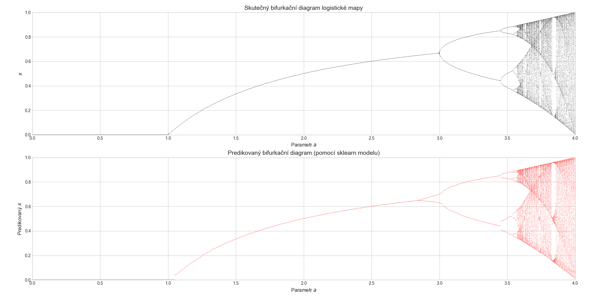

# Teorie chaosu: Logistická mapa, chaotická čísla a jejich predikce

## Popis problému

V tomto projektu jsem se zabývala studiem teorie chaosu, konkrétně logistickou mapou a její předpovědí pomocí neuronové sítě. Logistická mapa je definována rekurentní rovnicí:

𝑥ₙ₊₁ = 𝑎 · 𝑥ₙ · (1 − 𝑥ₙ)

kde 𝑎 je parametr, který určuje chování systému. Logistická mapa je známa svým chaotickým chováním pro určité hodnoty parametru 𝑎.

Úkolem bylo:
1. Implementovat logistickou mapu
2. Vizualizovat bifurkační diagram pro různé hodnoty parametru 𝑎
3. Použít neuronovou síť k predikci logistické mapy
4. Vizualizovat bifurkační diagram předpovězený neuronovou sítí

## Implementace

Pro řešení jsem použila Python a následující knihovny:
- NumPy pro práci s numerickými daty
- Matplotlib pro vizualizaci
- scikit-learn pro implementaci neuronové sítě (MLPRegressor)

Vytvořila jsem tři hlavní třídy:
1. **LogisticMap** - implementace samotné logistické mapy a generování dat
2. **LogisticMapPredictor** - třída pro trénování a predikci pomocí neuronové sítě
3. **BifurcationVisualizer** - třída pro vizualizaci bifurkačních diagramů

Použitá neuronová síť je vícevrstvý perceptron s architekturou (128, 64, 32) a ReLU aktivační funkcí. Pro optimalizaci jsem použila Adam optimalizátor.

Data pro trénování jsem generovala pro hodnoty parametru 𝑎 v rozmezí 0.0 až 4.0, s 200 různými hodnotami 𝑎 a 150 body pro každou hodnotu 𝑎.

## Výsledek

Výsledky ukazují, že neuronová síť je schopna poměrně dobře predikovat chování logistické mapy i v chaotických oblastech (přibližně pro 𝑎 > 3.57). Bifurkační diagram znázorňuje, jak se systém mění od stabilního stavu přes bifurkace až po chaos.

Na horním obrázku je znázorněn skutečný bifurkační diagram logistické mapy, zatímco spodní obrázek ukazuje predikci pomocí neuronové sítě. Je vidět, že neuronová síť dokáže zachytit hlavní vlastnosti systému, včetně bifurkačních bodů a oblastí chaosu.

Projekt ukazuje, že i jednoduché nelineární systémy mohou vykazovat složité chaotické chování a že moderní metody strojového učení mohou být použity k jejich predikci.